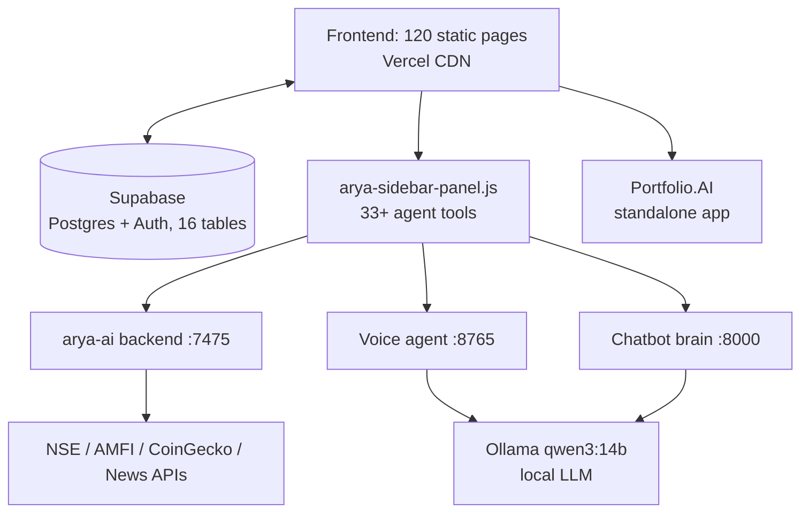

# FIN-OS — Architecture Requirements Document (ARD)

Oct 3, 2026 · @Vikas

> Exported from the living Claude Doc: https://claude.ai/artifact/YZKouTjfbBR5QCYs2RqXCh — edit there and re-export to refresh this copy.

Defines the requirements that influence FIN-OS's system architecture — how its static frontend, hosted database, and local backends must fit together.

## System architecture

FIN-OS is a **hub-and-spoke** architecture: one static frontend hub, one always-on hosted database, and independent local backend spokes that the frontend degrades gracefully without.

| Component | Responsibility |
| --- | --- |
| Frontend (120 pages) | Rendering, client-side logic, direct Supabase reads/writes |
| Supabase | System of record for profile, transactions, goals, holdings, alerts, memory |
| arya-sidebar-panel.js | UI + orchestration for the AI copilot across all its tabs |
| arya-ai backend (7475) | Live market/news data gateway, technical/sentiment analysis |
| Voice agent (8765) | STT → LLM → TTS pipeline |
| Chatbot brain (8000) | QFT chat engine for financial Q&A |
| Portfolio.AI | Self-contained analytics app, no shared backend dependency |

## Integration points & data flow

- **Frontend ↔ Supabase:** every page that needs user data loads `finos-context.js` first, which sets `window.FINOS_USER_CONTEXT` and fires `finos-context-ready` — downstream modules (personalization, Arya) wait on that event rather than querying Supabase independently.
- **Arya ↔ local backends:** `arya-ai.js` calls the arya-ai backend (7475) via a single tool gateway (`POST /api/tool`) rather than each of the 33+ tools having its own endpoint contract — one integration surface to maintain.
- **Voice ↔ Ollama:** the voice agent and chatbot brain both depend on the same local Ollama instance; only one can hold the GPU/CPU-bound model context at a time in practice.
- **Cross-page state:** localStorage keys (`finos_net_worth`, `finos_goals`, `finos_streak`, etc.) act as a fast client-side cache layer that PULSE and personalization read before falling back to a Supabase round-trip.

## Architectural constraints

- **Vercel serves static files only** — any component requiring server-side execution (voice, live alerts, live market data, the chat brain) must run outside Vercel, which is why 9 backends exist as separate local services instead of API routes.
- **Port 8000 is no longer shared** by `chatbot/brain.py` and `stock-engine` — the stock engine now runs on 8003, and the nginx gateway (:8000) maps every service to a distinct upstream port.
- **No shared backend framework** — Flask and FastAPI are both in use across the 9 backends, so integration is via HTTP/WebSocket contracts, not shared code.
- **Single Supabase project** for all 16 tables — no per-feature database isolation; schema changes are global.

## Scalability & planned evolution

- **Phase 13 (Zerodha Kite API):** adds a live brokerage data spoke — the client (finos-kite.js) and arya-ai proxy are built; it goes live once API keys are set. It follows the existing arya-ai pattern (one gateway, not per-feature endpoints).
- **Phase 15 (Supabase auth everywhere):** currently blocked: the Supabase project the site points to no longer resolves, so pages run in guest mode. A new project is needed before a full rollout can remove the last pages relying on `guard.js` redirects without a backing session check.
- **Phase 16 (SEBI Account Aggregator):** the biggest architectural shift (only a client scaffold, finos-aa.js, exists today) — introduces consented, pulled financial data from external FIPs (Finvu, OneMoney, Perfios, CAMS MF), which will need its own ingestion/normalization layer before landing in the existing Supabase schema.
- **Phase 17 (Expo / React Native app, in progress):** the app ports the website's formulas into pure TypeScript modules (mobile/lib) and checks them for parity against the web code; sharing the logic in one platform-agnostic package instead of porting it remains the cleaner long-term option.

**Added October 2026**

- **Gateway:** an nginx API gateway on :8000 fronts every backend with per-IP rate limits (stricter for LLM routes), an origin allow-list and SSE-safe proxying; `gateway/health_aggregator.py` reports aggregated service health.
- **Client data layer:** `finos-store.js` and `finos-api.js` centralise storage and backend URLs, so pages no longer hard-code ports.
- **Mobile client:** the Expo app in `mobile/` is a second frontend talking to the same arya-ai backend and Supabase `holdings` table, with on-device `finos_*` storage mirroring the web's keys.
