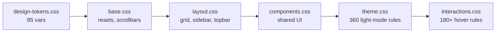

# FIN-OS — Design Requirements Document (DRD)

Oct 3, 2026 · @Vikas

> Exported from the living Claude Doc: https://claude.ai/artifact/CPL1vh8gLCdJXpThtdDtiK — edit there and re-export to refresh this copy.

Defines the requirements for FIN-OS's visual and interaction design system, so every new page stays consistent with the other 119.

## Design system foundation

A single source of truth cascades down through 4 layered CSS files, loaded in a fixed order on every page:

**Non-negotiable rules:**

- Never hardcode `rgba()` backgrounds or `color: #fff` — always reference a CSS variable from `design-tokens.css`.
- Every new CSS file must include a `[data-theme="light"]` override block for every rule that uses color.
- No new page ships without the full 6-file load order plus page-specific CSS after it.

## Interaction / hover system

Zero-fill vocabulary — no element ever gets a flat background-fill hover. `interactions.css` (465 lines, 180+ rules, all `!important`) plus `interactions.js` (strips inline `onmouseover` handlers) enforce this at runtime.

| Element | Hover pattern |
| --- | --- |
| Cards | `translateY(-4px)` + border-glow + depth shadow |
| Sidebar nav links | Text brightens + icon shifts to accent color |
| Ghost buttons | Border glow + focus ring |
| Tabs / chips | Border accent only, no fill |
| TOC links | 2px left accent bar slides in |
| Table rows | Left accent bar + text shift |
| Danger buttons | Transparent background + red border glow |

## Theming

**Platform-wide (all 120 pages):** Dark and Light, switched via `data-theme` attribute, toggled by `js/ui.js` (auto-injected on every page), persisted via `theme-init.js`/`theme.js`. Chart.js instances re-theme globally on toggle.

**Portfolio.AI-specific (self-contained app, 4 themes):**

| Theme | Trigger | Palette |
| --- | --- | --- |
| Dark (default) | Swatch / cycle | Indigo/violet on near-black |
| Light | Swatch / cycle | Navy on white |
| Bloomberg Terminal | `data-theme="bloomberg"` | `#00ff41` green on `#000` black |
| Saffron | `data-theme="saffron"` | Saffron `#ff8c00` + cream `#f5e6c8` on dark amber |

`setTheme()` is the single source of truth for Portfolio.AI — it syncs the `data-theme` attribute, localStorage (`portfolioai_theme`), button text, swatch state, and chart re-render together. Never set `data-theme` manually.

## Accessibility & responsive requirements

- `color-scheme` CSS property set per theme so native browser controls (scrollbars, form inputs) match — WCAG-aligned.
- Anti-FOUC IIFE must be the very first `<script>` in `<head>`, before any stylesheet, on every page — no flash of the wrong theme on load.
- Theme toggle button present on 100% of pages (auto-injected by `js/ui.js` where missing).
- Mobile navigation via a dedicated overlay (`mobile-nav.js`) — not a shrunk desktop sidebar.
- Smooth transitions (`background/color/border-color`, 0.2–0.25s) on theme change, defined in `base.css`/`animations.css`, so a toggle never feels like a hard cut.
- Text contrast is measured, not assumed: axe contrast failures fell from 596 to 29 nodes, and a runtime contrast healer (`js/finos-contrast.js`) nudges failing colours in light mode; the real fix remains per-component CSS.
- Pages include a skip link, named charts and shared label helpers (`js/finos-a11y.js`); touch targets follow shared 44px rules in `css/interactions.css`, and no page may scroll sideways at 375px.

## New-page checklist

- [ ] Anti-FOUC IIFE as the very first `<script>` in `<head>`
- [ ] Full 6-file CSS load order (`design-tokens.css` → `base.css` → `layout.css` → `components.css` → `theme.css` → `interactions.css`) plus page-specific CSS after
- [ ] Theme toggle button in the page header
- [ ] `[data-theme="light"]` override block for every color rule in any new CSS
- [ ] No hardcoded `rgba()`/`#fff`/`color: white` — CSS variables only
- [ ] Zero-fill hover vocabulary only — no flat background-fill hovers
- [ ] If the page tracks user data: registered in the global ⌘K search index (`finos-search.js`)
- [ ] `pwa-init.js` and the passcode-lock boot script (`finos-vault-boot.js`) loaded so the page installs offline and respects the lock
- [ ] `npm run audit` passes (fails if the page is missing from the search index; regenerate it with `scripts/build-search-index.js`)
- [ ] Checked at 375px width and in both themes (`npm run smoke`)
